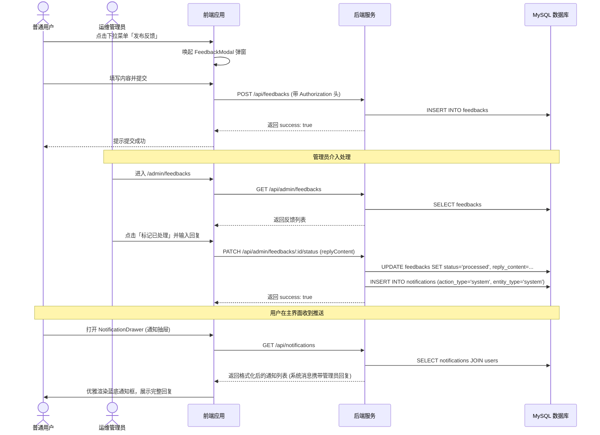

# 用户反馈与后台回复系统设计文档 (Feedback & Notification System)

## 1. 业务背景与架构决策
原有的反馈中心设计由于直接以路由形式（`/feedback`）暴露，导致普通用户可以浏览包含他人匿名反馈或敏感系统问题的列表。为了提升用户数据隐私安全性并降低运维成本，我们对该功能进行了重构。

### 架构方案对比 (Architectural Trade-offs)

| 维度 | 方案 A：独立反馈中心路由 | 方案 B：前台仅提交 + 后台统一审查 | 方案 C (最终选用)：前台气泡弹窗 + 后台回复推送 (通知中心集成) |
| :--- | :--- | :--- | :--- |
| **开发成本** | 低 (直接复用老页面) | 中 | 中 |
| **信息隔离** | 差 (普通用户能看到全局系统故障) | 优 (完全单向隔离) | 优 (完全单向隔离) |
| **交互闭环** | 中 (用户需要定期主动打开页面查看) | 差 (用户无法获得处理结果) | 极佳 (通过通知中心异步高亮推送，无感闭环) |
| **系统安全性**| 存在信息泄漏风险 | 安全 | 安全且交互友好 |

**推荐理由**: 方案 C 兼顾了普通用户的信息安全以及交互体验，用最小的改动在通知中心中完成了“反馈提交 -> 管理员回复 -> 用户查看回复”的闭环。

---

## 2. 系统流图与数据库设计

### 2.1 数据库模式设计

```sql
-- feedbacks 反馈表结构调整
ALTER TABLE feedbacks ADD COLUMN reply_content TEXT DEFAULT NULL COMMENT '管理员回复内容';
ALTER TABLE feedbacks ADD COLUMN reply_at BIGINT DEFAULT NULL COMMENT '管理员回复时间戳（毫秒）';
ALTER TABLE feedbacks ADD COLUMN status ENUM('pending', 'processed', 'ignored') DEFAULT 'pending' COMMENT '处理状态';
```

### 2.2 核心业务时序图



---

## 3. 防御性设计与工程规范 (Security & Performance)

### 3.1 零信任原则 (Zero Trust)
* **API 鉴权**: 所有的反馈修改、删除以及列表拉取接口均在 `/api/admin/*` 下，受 `AdminGuard` 和后端的管理员角色权限校验中间件双重拦截。非 `admin` 用户试图请求 `PATCH /api/admin/feedbacks/*` 会立即被返回 `403 Forbidden`。
* **通知防越权**: 用户拉取通知列表接口 `GET /api/notifications` 在 SQL 查询中强制绑定了当前登录态中的 `receiver_id = req.user.id`，防止水平越权读取他人的通知。

### 3.2 极限推演与性能瓶颈 (Bottlenecks & Scale)
* **问题点**: 当并发用户量急剧放大（例如系统发生线上故障，数万用户同时提交反馈并触发管理员批量回复），通知中心的写入性能和拉取性能将成为瓶颈。
* **防护手段**:
  1. **批量写入队列**: 后续可将 `NotificationService.createNotification` 剥离到 `BullMQ` 异步队列中，防止突发写通知请求阻塞管理员的 PATCH 接口响应。
  2. **覆盖索引优化**: 在 `notifications` 表中，我们建立了复合索引 `idx_receiver_unread(receiver_id, is_read, created_at DESC)`。该索引覆盖了用户打开通知抽屉时的常见查询场景，极大地缩减了扫描行数。
