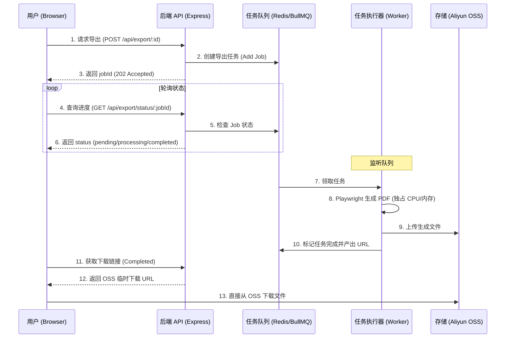

# 高可靠异步导出系统设计方案 (Scalable Export System)

针对 2核 2G 服务器在 100 人并发环境下的资源限制，本方案通过 **BullMQ (Redis)** 引入异步任务队列，将高能耗的 PDF 生成操作从主进程中剥离，实现削峰填谷。

## 1. 核心架构

---

## 2. 关键变更点

### 2.1 基础设施 (Infrastructure)
- **Redis**: 需要在阿里云服务器运行 Redis。考虑到内存限制，建议配置 `maxmemory 200mb` 并设置淘汰策略。

### 2.2 后端 (Server-side)
- **[NEW] `QueueService.ts`**: 初始化 BullMQ 实例，定义 `export-queue`。
- **[NEW] `ExportWorker.ts`**: 独立的任务处理器。
    - **并发控制**：设置 `concurrency: 1`。确保 2C2G 服务器在同一时刻仅运行一个浏览器实例，防止 OOM。
- **[MODIFY] `ExportService.ts`**: 
    - 修改 `exportBook` 方法，不再直接执行策略，而是调用 `QueueService.addJob()`。
- **[NEW] 状态接口**: 
    - `GET /api/export/job/:jobId`: 获取任务详情。

### 2.3 前端 (Frontend)
- **[NEW] `ExportProgressModal.tsx`**: 显示生成进度进度条。
- **轮询逻辑**: 使用 `setInterval` 或 `React Query` 的轮询功能，直到任务状态变为 `completed`。

---

## 3. 2C2G 环境下的特殊优化指标

> [!IMPORTANT]
> **资源隔离与保护策略**：
> 1. **严格限流**：Worker 并发数设为 1。这意味着第 2 个导出的用户需要排队，但 API 响应（浏览书籍）依然流畅。
> 2. **内存预警**：一旦内存占用超过 85%，Worker 自动拒绝新任务并等待。
> 3. **文件清理**：PDF 生成后立即上传 OSS，随后删除服务器上的临时 Buffer，保持内存释放。

## 4. 实施阶段计划

1. **第一阶段：环境准备**：确认 Redis 服务可用，并安装 `bullmq` 依赖。
2. **第二阶段：后端改造**：实现异步任务下发与 Worker 逻辑，集成 OSS 上传。
3. **第三阶段：前端适配**：开发任务等待 UI 与轮询逻辑。
4. **第四阶段：压力测试**：模拟多用户同时导出，确保服务器不宕机且任务有序排队。
